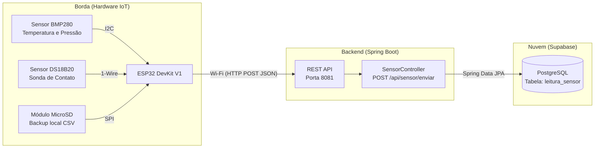

# 📡 Telemetria IoT & Backend - FM-BIM UFC Russas

Este repositório contém a infraestrutura completa (Hardware, Firmware e Backend) de um sistema de Telemetria IoT ambiental. O projeto foi desenvolvido como parte das atividades da Bolsa de Iniciação Acadêmica (BIA), vinculado ao projeto **FM-BIM (Modelagem Informatizada em Apoio à Gestão Sustentável do Campus)** da Universidade Federal do Ceará - Campus Russas.

O objetivo do sistema é atuar como uma rede de sensores para coletar dados físicos (temperatura e pressão) das edificações universitárias, alimentando a tomada de decisão da prefeitura do Campus para otimizar o conforto ambiental e reduzir o desperdício de energia elétrica e recursos, integrando os dados ao gerenciamento de *facilities* via metodologia BIM.

---

## 🏗️ Arquitetura do Sistema

O projeto adota uma arquitetura em camadas, garantindo baixo consumo energético na borda e alta disponibilidade na nuvem:



---

## 📌 Pinagem do Hardware

| Componente | Pino ESP32 | Protocolo |
|---|---|---|
| BMP280 — SDA | GPIO 21 | I2C |
| BMP280 — SCL | GPIO 22 | I2C |
| DS18B20 — DATA | GPIO 5 | 1-Wire |
| DS18B20 — Pull-up | 4.7 kΩ entre DATA e VCC | — |
| MicroSD — CS | GPIO 4 | SPI |
| MicroSD — SCK | GPIO 18 | SPI |
| MicroSD — MISO | GPIO 19 | SPI |
| MicroSD — MOSI | GPIO 23 | SPI |

---

## 🔋 Firmware — Comportamento (Versão de Produção)

✅ **Deep Sleep ativo** — o ESP32 acorda a cada 10 minutos (600 s), executa o ciclo completo de leitura e envio dentro do `setup()`, e volta a dormir. O `loop()` fica vazio por design.

✅ **Backup local em SD** — a cada ciclo, as leituras são gravadas no arquivo `/telemetria_log.csv` no cartão SD (formato CSV com separador `;`). O log é cumulativo (append) e sobrevive a reinicializações e falhas de Wi-Fi.

**Fluxo de um ciclo:**
1. Acorda (boot ou wake do Deep Sleep)
2. Inicializa sensores e cartão SD
3. Conecta ao Wi-Fi (timeout de 15 s)
4. Lê BMP280 (temperatura + pressão) e DS18B20 (temperatura de contato)
5. Grava leitura no SD
6. Envia leitura via HTTP POST para o backend (se Wi-Fi disponível)
7. Desliga rádio Wi-Fi
8. Entra em Deep Sleep por 600 s

**Resiliência:** se o Wi-Fi falhar, as leituras são salvas apenas no SD sem interromper o ciclo — o dispositivo volta a dormir normalmente.

---

## ⚙️ Configuração

Crie o arquivo `firmware/esp32_telemetria/secrets.h` a partir do template:

```bash
cp firmware/esp32_telemetria/secrets.h.example firmware/esp32_telemetria/secrets.h
```

Edite com suas credenciais reais (o arquivo está no `.gitignore` e nunca será commitado):

```cpp
#define WIFI_SSID     "nome-da-sua-rede"
#define WIFI_PASSWORD "sua-senha-wifi"
#define SERVER_URL    "http://192.168.x.x:8081/api/sensor/enviar"
```

> **Nota:** se o IP do computador mudar, atualize `SERVER_URL` no `secrets.h` e recompile. Use `ipconfig` (Windows) para verificar o IPv4 atual.
