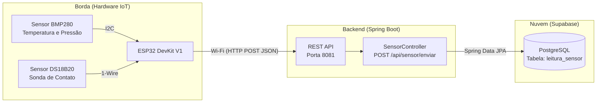

# 📡 Telemetria IoT & Backend - FM-BIM UFC Russas

Este repositório contém a infraestrutura completa (Hardware, Firmware e Backend) de um sistema de Telemetria IoT ambiental. O projeto foi desenvolvido como parte das atividades da Bolsa de Iniciação Acadêmica (BIA), vinculado ao projeto **FM-BIM (Modelagem Informatizada em Apoio à Gestão Sustentável do Campus)** da Universidade Federal do Ceará - Campus Russas.

O objetivo do sistema é atuar como uma rede de sensores para coletar dados físicos (temperatura e pressão) das edificações universitárias, alimentando a tomada de decisão da prefeitura do Campus para otimizar o conforto ambiental e reduzir o desperdício de energia elétrica e recursos, integrando os dados ao gerenciamento de *facilities* via metodologia BIM.

---

## 🏗️ Arquitetura do Sistema

O projeto adota uma arquitetura em camadas, garantindo baixo consumo energético na borda e alta disponibilidade na nuvem:

